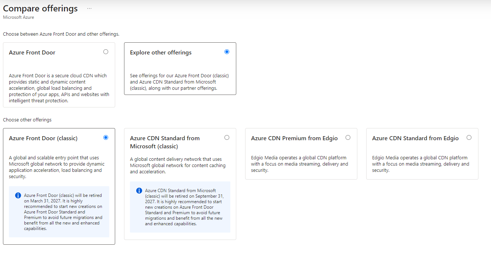
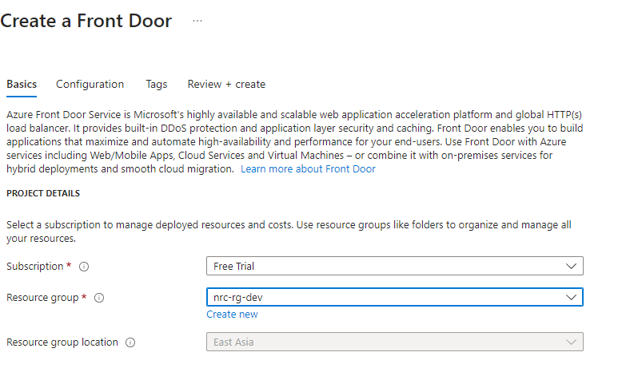
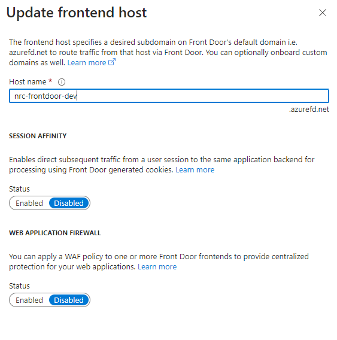
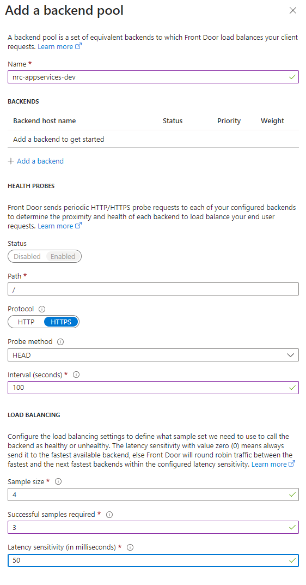
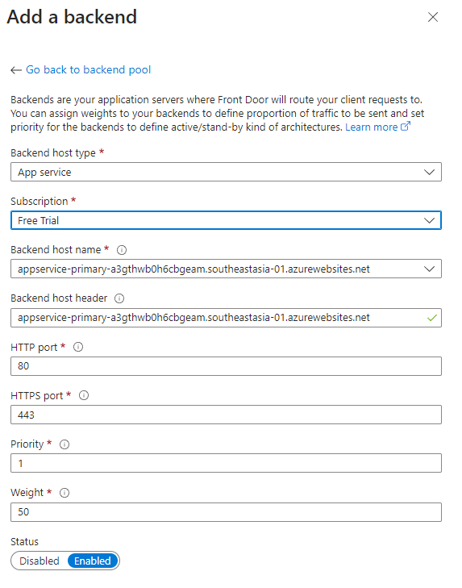
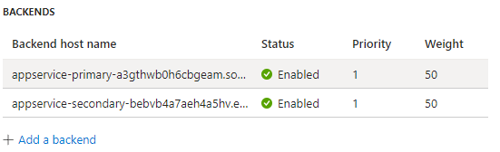

## 5. Azure Front Door

---

### Configure Frontend + Domains

In **Configuration**, click **“+”** under **Frontends and Domains**.  
Give a desired name and create.

---

### Create Backend Pool

Click **“+”** on **Backend Pools**.

Now add a backend (your App Service).

Click **“Add a backend”** inside **Backends**.

---

### Create Backends for Primary & Secondary App Services

***Create the backends for both appservice-primary and appservice-secondary.***

***Create the backends for both appservice-primary and appservice-secondary.***

---

### Create Routing Rules

Click **“+”** on Routes, give a route name, and deploy Azure Front Door.

