## 6. Create Azure Self-Hosted Agent-Pool

The build pipelines we create will run on the Agent Pool (which is nothing but a VM).

So we need to set up the VM for running our build pipelines.

If you have deleted the previously created VM (which is a good practice because we are broke XD), go ahead and create a new VM by referring to the above process.

After creating the VM, SSH into the VM.

*SSH is nothing but accessing the VM (remote resource) from your local machine.*

*Before that, make sure you have downloaded the private_key.*

*And have the public IP of the VM in hand (it can be found in VM overview details).*

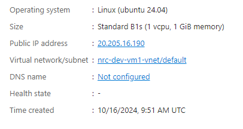

---

Open **cmd**,  
Enter the command:

```
ssh -i <private_key_path> azureuser@<public_ip_of_vm>
```


After running the command, type **yes** if it asks for input.

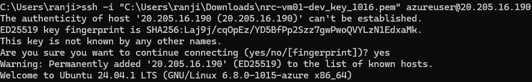

---

After SSH-ing into the VM, we should configure it as an agent pool.

Go to your Azure DevOps project  
(In my case: https://dev.azure.com/ranjithchowdary2001/baasic-reactjs)

Navigate to:  
**Project settings → Agent Pools → Add pool**

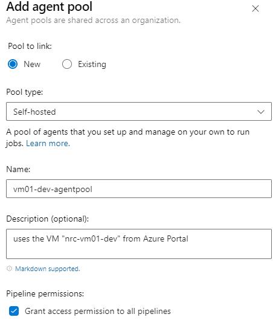

Click **Create**.

---

Go to the terminal where you established the SSH connection.

Run:

```
mkdir myagent && cd myagent
```


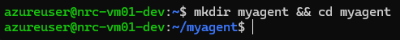

---

Run the command to download the agent package:

```
wget https://vstsagentpackage.azureedge.net/agent/2.214.1/vsts-agent-linux-x64-2.214.1.tar.gz
```


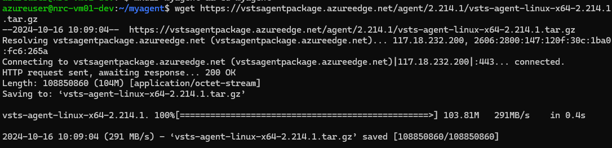

---

Extract the package using:

```
tar zxvf vsts-agent-linux-x64-2.214.1.tar.gz
```


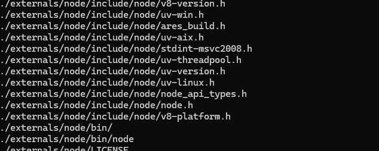

---

Run:

```
ls -al
```


You should see **config.sh** and **env.sh**.

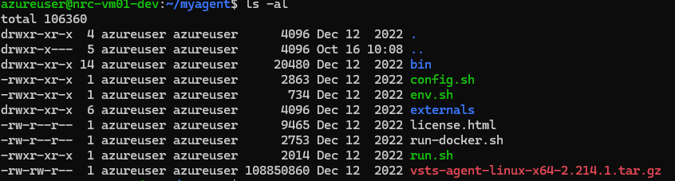

---

Start configuration:

```
./config.sh
```


If you get this error:

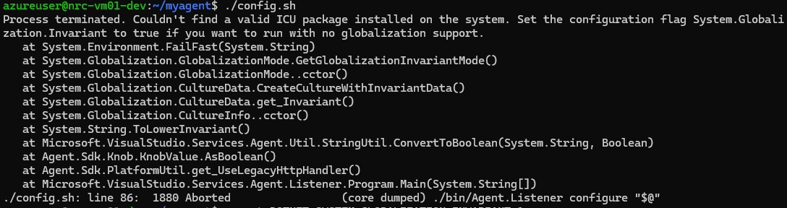

Run:

```
export DOTNET_SYSTEM_GLOBALIZATION_INVARIANT=1
```


And then again run:

```
./config.sh
```


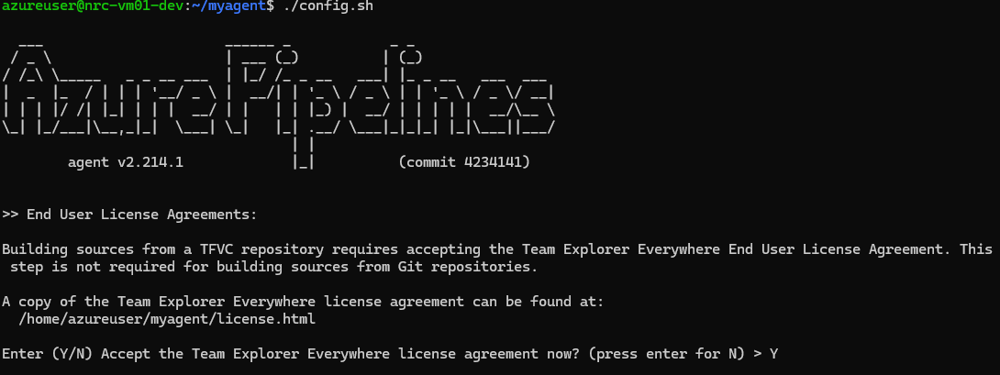

---

Accept the license agreement by typing **Y**.

It asks for the server URL — enter:

```
https://dev.azure.com/<yourorganization>
```

Example:

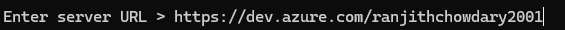

---

When asked for authentication type, choose **PAT (Personal Access Token)**.

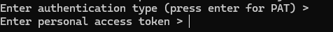

To generate PAT:

Go to:  
**User Settings → Personal Access Token**

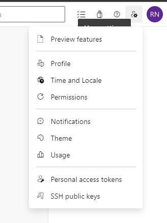

Click **New Token**

Scroll down → click **Show All Scopes**

Enable:

- **Agent Pools → Read & Manage**

Click **Create**.

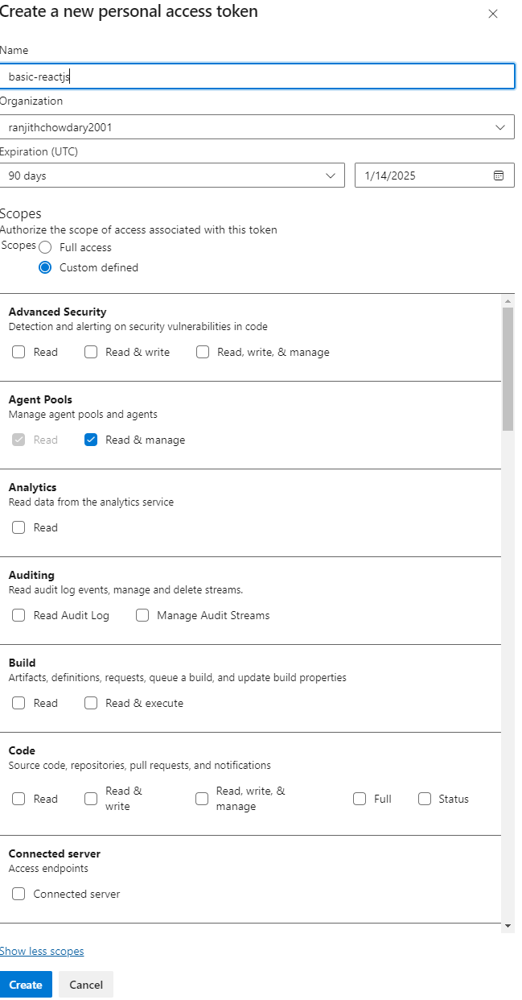

---

**Make sure to copy the token** (you won't see it again).

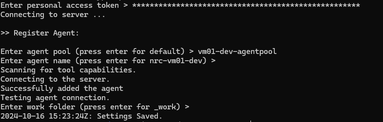

---

Next, configure the self-hosted agent service:

```
sudo ./svc.sh install &
```


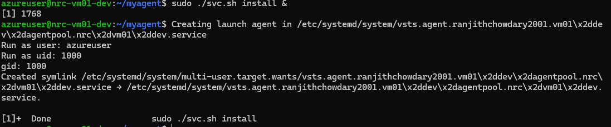

---

Start the agent service:

```
./runsvc.sh
```


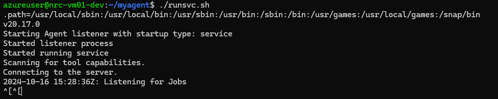

---

Now your **self-hosted agent is ready** to run build pipelines!
